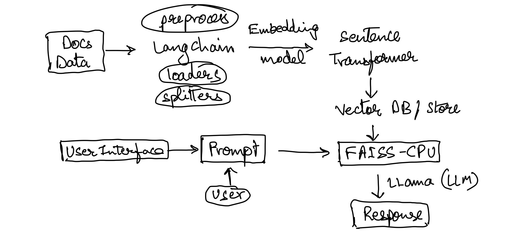

# Medical-Bot using Llama 2

## Overview

This is a medical chatbot that utilizes Llama2 from Meta along with Sentence Transformers to provide real-time medical information and advice. All model inferences run locally on the user's CPU, ensuring data privacy by not transmitting any information online. The system requires a minimum of 16GB of RAM to operate smoothly, as the model is quite resource-intensive. It leverages specialized embeddings that have been fine-tuned using data from a comprehensive Medical Encyclopedia in PDF format. The chatbot is hosted on the ChainLit framework and leverages Langchain technology to efficiently process and respond to user queries.

## Features

- **Pre-trained and Quantized LLama 2 Model**: Llama 2 pretrained model, that is trained on 2 trillion tokens, and have double the context length than Llama 1. Its fine-tuned models have been trained on over 1 million human annotations. I used the weights converted by (TheBloke)[https://huggingface.co/TheBloke].
- **CTransformers**: CTransformers is a python binding for ML C library - (GGML)[https://github.com/ggerganov/ggml], which is a tensor library for machine learning to enable large models and high performance on commodity hardware
- **Sentence Transformer Embeddings (All MiniLM v6)**: SentenceTransformers is a Python framework for state-of-the-art sentence, text and image embeddings.
- **Vector Store Options**: Vector databases with LLMs can handle large-scale, high-dimensional data, enabling more nuanced, context-aware, and efficient natural language understanding applications.
    - **Chroma DB**
    - **Faiss CPU**
    - **Qdrant**

## Architecture



## Usage

### Creating the Vector Database

The first step is to populate the vector database with medical documents for the chatbot to search.

```bash
# Run this script to populate the vector database
python digest.py
```

### Start the Chatbot

The chatbot can be initiated using the following command.

```bash
# Start the chatbot
python model.py
```

